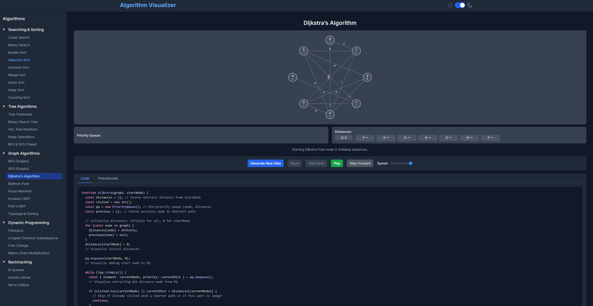

# Algorithm Visualizer

An interactive web application designed to help users visualize various algorithms. This tool provides a visual representation of how different algorithms operate, making it easier to understand their step-by-step execution.

## Features

* **Interactive Visualizations:** Watch algorithms in action with dynamic visual representations.
* **Algorithm Selection:** Choose from a wide range of algorithms across different categories.
* **Step-by-Step Control:**
    * **Play/Pause:** Control the animation flow.
    * **Step Forward/Backward:** Move through the algorithm's execution one step at a time.
    * **Reset:** Reset the visualization to its initial state.
    * **Generate New Data:** Create new random datasets for the visualizations.
* **Speed Control:** Adjust the animation speed for a customized learning experience.
* **Code and Pseudocode Display:** View the corresponding code and pseudocode for the selected algorithm.
* **Dark Mode:** Switch between light and dark themes for comfortable viewing.
* **Responsive Design:** The application is designed to work on different screen sizes.

## Technologies Used

* **HTML:** For the basic structure of the web application.
* **CSS:** For styling the application, including custom styles and Tailwind CSS.
* **JavaScript:** For the core logic, algorithm implementation, and visualization rendering.
* **Tailwind CSS:** A utility-first CSS framework used for styling the user interface.
* **Google Fonts (Inter):** For typography.

## Implemented Algorithms

The visualizer includes a variety of algorithms, including but not limited to:

### Searching & Sorting
* Linear Search
* Binary Search
* Bubble Sort
* Selection Sort
* Insertion Sort
* Merge Sort
* Quick Sort (Lomuto Partition)
* Heap Sort
* Counting Sort

### Tree Algorithms

* Tree Traversals (Inorder, Preorder, Postorder)
* Binary Search Tree (BST) Insertion
* AVL Tree (Insertion & Rotations)
* Heap Operations (Insert/Extract Max)
* BFS & DFS (Trees)

### Graph Algorithms

* Breadth-First Search (BFS) for Graphs
* Depth-First Search (DFS) for Graphs
* Dijkstra’s Algorithm
* Bellman-Ford Algorithm
* Floyd-Warshall Algorithm
* Kruskal’s MST Algorithm
* Prim’s MST Algorithm
* Topological Sorting (Kahn's Algorithm)

### Dynamic Programming

* Fibonacci (Recursive, Memoization, Tabulation)
* Longest Common Subsequence (LCS)
* Coin Change
* Matrix Chain Multiplication (MCM)

### Backtracking

* N-Queens
* Sudoku Solver
* Rat in a Maze

## How to Use

1.  Open the `index.html` file in your web browser.
2.  The application will load with a default view.
3.  **Select an Algorithm:** Use the sidebar navigation to choose an algorithm category and then select a specific algorithm.
4.  **Visualization Area:** The main area will display the algorithm's visualization. For array-based algorithms, this will typically be a bar chart. For tree/graph/DP algorithms, a dedicated "extra visualization area" will be used.
5.  **Controls:**
    * Use **"Generate New Data"** to create a new random dataset for the selected algorithm.
    * Click **"Play"** to start the animation or **"Pause"** to stop it.
    * Use **"Step Forward"** and **"Step Back"** to navigate the algorithm's execution step by step.
    * **"Reset"** will take the current visualization back to its initial state (before any steps were executed).
    * Adjust the **"Speed"** slider to control the animation playback speed.
6.  **Code/Pseudocode Tabs:** Below the controls, you can switch between "Code" and "Pseudocode" tabs to see the implementation details of the selected algorithm.
7.  **Dark Mode Toggle:** Use the sun/moon icon in the header to toggle between light and dark themes.

## Project Structure

* `index.html`: The main entry point of the application.
* `css/style.css`: Contains custom CSS rules for the application.
* `js/`: This directory contains the JavaScript files.
    * `main.js`: Handles the core application logic, UI interactions, state management, and orchestrates the visualizations.
    * `script.js`: Appears to import and list algorithm configurations (though its direct usage in `index.html` is not present, it indicates a potential structure or past usage).
    * `algorithms/`: This sub-directory holds the individual JavaScript files for each algorithm, each containing its configuration (name, code, pseudocode, setup function, and renderStep function). Examples include:
        * `linear-search.js`
        * `binary-search.js`
        * `bubble-sort.js`
        * `avl.js`
        * `dijkstra.js`
        * ...and many more.

## Setup

To run this project locally:

1.  Clone the repository or download the files.
2.  Ensure all files (`index.html`, `css/style.css`, and the `js` directory with all its contents) are in the same root directory.
3.  Open the `index.html` file in a modern web browser that supports JavaScript ES6 modules and Tailwind CSS (via CDN).

No special build steps or dependencies are required beyond a web browser, as Tailwind CSS is included via a CDN.

https://git-aarya.github.io/AlgorithmVisualizer/

